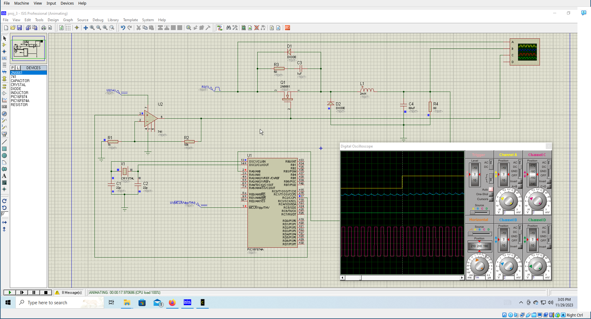

# A Program using PIC32 MCU implementing a PI controller

Schematics:


Working Simulation:


We used MatLab to calculate the PI controller discrete equation:

C = K p + K i I / F ( z ) + K d T f 


### MatLab code helped the PI controller.

```matlab
>> numC = [0 0 4.992];
>> denC = [1.6e-7 2.5e-4 1];
>> C = tf(numC,denC)

C =
 
             4.992
  ---------------------------
  1.6e-07 s^2 + 0.00025 s + 1
 
Continuous-time transfer function.

>> denC

denC =

    0.0000    0.0003    1.0000

>> sisotool(C)
>> nNew = [0 0 58.428]

nNew =

         0         0   58.4280

>> dNew= [ 0 1 0 ]

dNew =

     0     1     0

>> newTf = tf(nNew, dNew)

newTf =
 
  58.43
  -----
    s
 
Continuous-time transfer function.

>> dz = c2d(newTf, 0.001, 'zoh')

dz =
 
  0.05843
  -------
   z - 1
 
Sample time: 0.001 seconds
Discrete-time transfer function.

>> dz = c2d(newTf, 0.0001, 'zoh')

dz =
 
  0.005843
  --------
   z - 1
 
Sample time: 0.0001 seconds
Discrete-time transfer function.
```